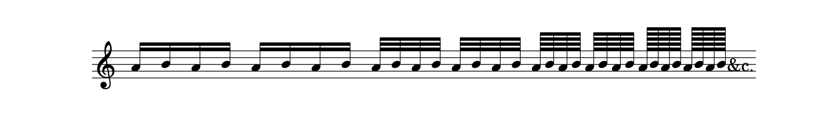

## A Letter from the late Signor Tartini to Signora Maddalena Lomardini (now Signora Sirmen) published as an important lesson to performers on the Violin. Translated by Dr. Burney.

### A LETTER, _&c._

PADUA, MARCH 5, 1760.

MY VERY MUCH ESTEEMED SIGNORA MADDALENA,

FINDING myself at length disengaged from the weighty business which has so long prevented me from performing my promise to you, a promise which was made with too much sincerity for my want of punctuality not to afflict me; I shall begin the instructions you wish from me, by letter; and if I should not explain myself with sufficient clearness, I entreat you to tell me your doubts and difficulties, in writing, which I shall not fail to remove in a future letter.

Your principal practice and study should, at present, be confined to the use and power of the bow, in order to make yourself entirely mistress in the execution and expression of whatever can be played or sung, within the compass and ability of your instrument. Your first study, therefore, should be the true manner of holding, balancing, and pressing the bow lightly, but steadily, upon the strings; in such a manner as that it shall seem to breathe the first tone it gives, which must proceed from the friction of the string, and not from percussion, as by a blow given with a hammer upon it. This depends on laying the bow lightly upon the strings, at the first contact, and on gently pressing it afterwards, which, if done gradually, can scarce have too much force given to it, because, if the tone is begun with delicacy, there is little danger of rendering it afterwards either coarse or harsh.

\[5\]

Of this first contact, and delicate manner of beginning a tone, you should make yourself a perfect mistress in every situation and part of the bow, as well in the middle as at the extremities ; and in moving it up, as well as in drawing it down. To unite all these laborious particulars into one lesson, my advice is, that you first exercise yourself in a swell upon an open string, for example, upon the second or _a-la-mi re_: that you begin _pianissimo_, and encrease the tone by slow degrees to its _fortissimo_; and this study should be equally made, with the motion of the bow up, and down, in which exercise you should spend at least an hour every day, though at different times, a little in the morning, and a little in the evening; having constantly in mind, that this practice is, of all others, the most difficult, and the most essential to playing well on the violin. When you are a perfect mistress of this part of a good performer, a swell will be very easy to you; beginning with the most minute softness, encreasing the tone to its loudest degree, and diminishing it to the same point of softness with which you began, and all this in the same stroke of the bow. Every degree of pressure upon the string, which the expression of a note or passage shall require, will by this means be easy and certain; and you will be able to execute with your bow whatever you please. After this, in order to acquire that light pulsation and play of the wrist, from whence velocity in bowing arises, it will be best for you to practise, every day, one of the _allegros_, of which there are three in Corelli's solos, which entirely move in semiquavers. The first is in D. in playing which you should accelerate the motion a little each time, till you arrive at the greatest degree of swiftness possible : but two precautions are necessary in this exercise; the first is, that you \[6\] play the notes _staccato_, that is, separate and detached, with a little space between every two : for though they are written thus,

they should be played as if there was a rest after every note, in this manner,

The second precaution is, that you first play with the point of the bow; and when that becomes easy to you, that you use that part of it which is between the point and the middle; and when you are likewise mistress of this part of the bow, that you practise in the same manner with the middle of the bow; and above all, you must remember in these studies to begin the _allegros_ or flights sometimes with an up-bow, and sometimes with a down-bow, carefully avoiding the habit of constantly practising one way. In order to acquire a greater facility of executing swift passages in a light and neat manner, it will be of great use if you accustom yourself to skip over a string between two quick notes in divisions, like these,

Of such divisions you may play extempore as many as you please, and in every key, which will be both useful and necessary.

With regard to the finger-board, or carriage of the left-hand, I have one thing strongly to recommend to you, which will suffice for all, and that is, the taking a violin part, either the first or second of a concerto, sonata, or song, any thing will serve the purpose, and playing \[7\] it upon the half-shift, that is, with the first finger upon G on the first string, and constantly keeping upon this shift, playing the whole piece without moving the hand from this situation, unless A on the fourth string be wanted, or D upon the first; but, in that case, you should afterwards return again to the half-shift, without ever moving the hand down to the natural position. This practice should be continued till you can execute with facility upon the half-shift, any violin part, not intended as a solo, at sight. After this, advance the hand on the finger-board to the whole-shift, with the first finger upon A, on the first string, and accustom yourself to this position till you can execute every thing upon the whole-shift with as much ease as when the hand is in its natural situation; and when certain of this, advance to the double-shift, with the first finger upon B, on the first string; and when sure of that likewise, pass to the fourth position of the hand, making C with the first finger upon the first string; and indeed this is a scale in which, when you are firm, you may be said to be mistress of the finger-board. This study is so necessary, that I most earnestly recommend it to your attention.

I now pass to the third essential part of a good performer on the violin, which is the making a good shake, and I would have you practise it slow, moderately fast, and quick; that is, with the two notes succeeding each other in these three degrees of _adagio_, _andante_, and _presto_; and in practice you have great occasion for these different kinds of shakes; for the same shake will not serve with equal propriety for a slow movement as for a quick one; but to acquire both at once with the same trouble, begin with an open string, either the first or second, it will be equally useful; sustain the note in a swell, and begin \[8\] the shake very slow, encreasing in quickness, by insensible degrees, till it becomes rapid, in the manner following :

but you must not rigorously move immediately from semiquavers to demisemiquavers, as in this example, or from these to the next in degree, that would be doubling the velocity of the shake all at once, which would be a skip, not a gradation; but you can imagine between a semiquaver and a demisemiquaver intermedite degrees of rapidity, quicker than the one, and slower than the other of these characters, you are therefore to encrease in velocity, by the same degrees in practising the shake, as in loudness, when you make a swell. You must attentively and assiduously persevere in the practice of this embellishment, and begin at first with an open string, upon which, if you are once able to make a good shake with the first finger, you will with the greater facility acquire one with the second, the third, and the fourth or little finger, with which you must practise in a particular manner, as more feeble than the rest of its brethren. I shall, at present, propose no other studies to your application, what I have already said is more than sufficient, if your zeal is equal to my wishes for your improvement. I hope you will sincerely inform me, whether I have explained myself clearly thus far; that you will accept of my respects, which I likewise beg of you to present to the Prioress, to Signora Teresa, and to Signora Chiara, for all whom I have a sincere regard; and believe me to be, with great affection,

Your obedient, and most humble servant,  
JOSEPH TARTINI.