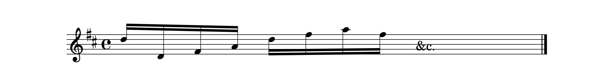
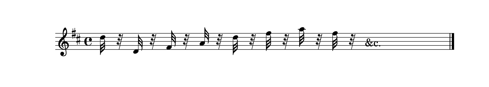
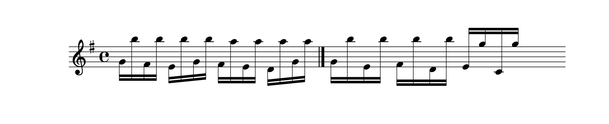

## Lettera del defonto Signor Giuseppe Tartini alla Signora Maddalena Lombardini inserviente Ad une importante Lezione per i Suonatori di Violino.

### LETTERA, ec.

SIG. MADDALENA MIA STIMATISSIMA,

PADOVA LI 5, MARZO. 1760.

FINALMENTE, quando a Dio è piaciuto, mi sono sbrigato da quella grave occupazione, che fin quì mi ha impedito di mantenerle la mia promessa, sebben anche troppo mi stava al cuore, perchè di fatto mi affliggeva la mancanza di tempo. Incominciamo dunque col nome di Dio per lettera, e se quanto quì espongo ella non intende abbastanza, mi scriva, e dimandi spiegazione di tutto ciò, che non intende. Il di lei esercizio, e studio principale dev' essere l'arco in genere, cosicchè ella se ne faccia padrona assoluta a qualunque uso o sonabile o cantabile. Primo studio dev' essere l'appoggio dell'arco su la corda siffattamente leggiero, che il primo principio della voce, che si cava, sia come un fiato, e non come una percossa su la corda. Consiste in leggerezza di polso, e in proseguir subito l'arcata dopo l'oppoggio, rinforzandola quanto si vuole, perchè dopo l'appoggio leggiero non vi è più pericolo di asprezza, e crudezza.

\[4\]

Di questo appoggio così leggiero ella deve farsi padrona in qualunque sito dell'arco; sia in mezzo, sia negli estremi, e deve essserne padrona con l'arcata in sù, e con l'arcata in giù. Per far tutta la fatica in una sola volta s'incomincia dalla messa di voce sopra una corda vuota, per esempio sopra la seconda ch'è alamirè. S'incomincia dal pianissimo crescendo sempre a poco alla volta fin che si arriva al fortissimo ; e questo studio deve farsi egualmente con l'arcata in giù, e con l'arcata in sù. Ella incominci subito questo studio, e vi spenda almeno un'ora al giorno, ma interrotta ; un poco la mattina, un poco la sera ; e si ricordi bene, che questo è lo studio più importante e più difficile di tutti. Quando sarà padrona di questo, le sarà allora facile la messa di voce, che incomincia dal pianissimo, va al fortissimo, e torna al pianissimo, nella stessa arcata : le sarà facile e sicuro l'ottimo appoggio dell'arco alla corda, e potrà fare col suo arco tutto quello che vuole. Per acquistar poi questa leggerezza di polso, da cui viene la velocità dell'arco, sarà cosa ottima, che suoni ogni giorno qualche fuga del _Corelli_ tutta di semicrome, e queste fughe sono tre nell'Opera quinta a Violino solo, anzi la prima è nella prima sonata per Dlasolrè. Ella a poco alla volta deve suonarle, sempre più presto fin che arrivi a suonarle con quella tal velocità, che le sia più possibile. Ma bisogna avvertire due cose : prima di suonarle con \[5\] l'arco distaccato, cioè granito, e con un poco di vacuo tra una nota, e l'altra. Sono scritte nel modo seguente

ec. ma si devono suonare come fossero scritte

ec. Seconda di suonarle in punta di arco nel principio di questo studio, ma poi quando è padrona di farle bene in punta di arco, allora incominci a farle non più in punta, ma con quella parte d'arco, ch'è tra la punta, e il mezzo dell'arco ; e quando sarà padrona anche di questo sito dell'arco, allora le studj nello stesso modo in mezzo dell'arco ; e sopra tutto in questi studj si arricordi d'incominciar le fughe ora con l'arcata in giù, ora con l'arcata in sù ; e si guardi dall'incominciare sempre per l'in giù. Per acquistar questa leggerezza d'arco giova infinitamente il saltar una corda di mezzo, e studiar fughe di semicrome fatte in questo modo

ec. di questa ella se ne può fare a capriccio quante vuole, e per qualunque tuono, e veramente sono utili, e necessarie. Rispetto poi alla mano del manico una cosa sola le raccomando di studiare, la quale basta per tutte, ed è questa. Prenda qualunque parte di Violino o primo, o secondo ; sia di concerto, sia di qualche Messa, o Salmo, ogni cosa serve. Ponga la mano non a suo luogo, ma a mezza \[6\] smanicatura, cioè col primo dito in Gsolreut sul cantino, e tenendo sempre la mano in tale smanicatura suoni tutta quella parte del Violino, non movendo mai la mano da quel sito, se non che o quando dovrà toccar alamirè su la quarta corda, o dovrà toccar delasolrè sul cantino, ma poi torni con la mano alla stessa smanicatura di prima, nè mai al luogo naturale. Ella faccia questo studio fin che è sicura affatto di suonar qualunque parte di Violino (non obbligato a soli) a prima vista. Allora tiri innanzi la sua smanicatura in alamirè col primo dito sul cantino, faccia in questa seconda smanicatura lo stesso stessissimo studio fatto su la prima. Divenuta sicura anche di questa, passi alla terza smanicatura col primo dito in Bmì sul cantino, e se ne assicuri nello stesso modo. Assicurata passi alla quarta col primo dito in Csolfaut sul cantino ; e in somma questa è una Scala di smanicature, di cui quando ella se ne sia fatta padrona, può dire di esser padrona del manico. Questo studio è necessario, e glie lo raccomando. Passo al terzo ch'è il trillo. Io da lei lo voglio tardo, mediocre, e presto, cioè battuto adagio, mediocremente, e prestamente ; e in pratica si ha vero bisogno di questi trilli differenti, non essendo vero, che lo stesso trillo, che serve per un grave, debba esser lo stesso trillo, che serve per un allegro. Per far due studj in una volta con una sola fatica, ella incominci sopra una corda vuota, sia la seconda, sia il cantino, ch'è tutt'uno, un'arcata sostenuta come una messa di voce, e incominci \[7\] il trillo adagio adagio, e a poco alla volta per gradi insensibili lo vada riducendo al presto, come vede quì nell'esempio

ec. Ma ella non stia a rigore su questo esempio, in cui dalle semicrome si passa immediatamente alle biscrome, e da queste alle altre che vagliono la metà ec. No, questo sarebbe salto, e non grado ; ma ella s'immagini che tra le semicrome, e le biscrome vi siano altre note in mezzo, che vagliano meno delle semicrome, e più delle biscrome, ma che partendosi dalle semicrome siano di valore prossimo alle semicrome, e secondo che vanno innanzi, sempre più vadano avvicinandosi al valore delle biscrome, finchè arrivano ad esser vere biscrome, e così a proporzione tra le biscrome, e le successive, che vagliono la metà. Questo studio lo faccia con assiduità, e attenzione, e assolutamente lo incominci sopra una corda vuota, perchè s'ella arriverà a farlo bene sopra una corda vuota, molto meglio lo farà col secondo, col terzo dito, e anche col quarto, su cui bisogna far esercizio particolare, perchè è il più piccolo de' suoi fratelli. Null'altro per ora le propongo da studiare ; ma questo basta, e avanza, quando ella voglia dir da senno per la sua parte, come io le dico per parte mia. Mi risponderà, se ha ben inteso, quanto qui le ho proposto ; e intanto rassegnandole i miei rispetti, come la prego di far per mia parte alla Sig. Priora, alle Sig. Teresa, e Chiara, tutte mie Padrone, mi confermo sempre più

Di V. S. Mol. Illustre.

Devotiss. Affettuoss. Servitore

GIUSEPPE TARTINI.
